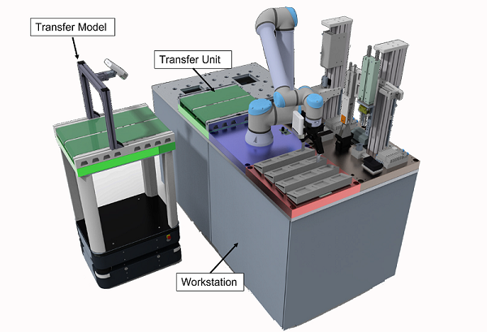
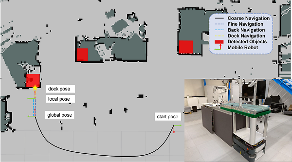

# Semantic Mapping and Autonomous Navigation for Agile Production System

**Related Paper:**  

+ Benchun Zhou, Jan-Felix Klein, Bo Wang, and Markus Hillemann. **Semantic Mapping and Autonomous Navigation for Agile Production System**[C]//2023 Under Review (submitted to CASE 2023). [[**Link**]()] [[**PDF**]()] [[**Slide**](./README_Picture/2023_CASE_Slide.pdf)] [[**Youtube**](https://youtu.be/4_sbpMSwPKs)] [[**Bilibili**](https://www.bilibili.com/video/BV1wk4y1t7q9)]

+ If you use the code in your academic work, please cite the above paper. 

## 0. AgiProbot 
To develop a production system for remanufacturing, in which used products can be disassembled with a high degree of automation. 7 institutes in KIT were involved and we (IFL) are responsible for developing an autonomous intra-logistics system for material flow, such as transporting the items among different workstations. [[**AgiProbot**](http://agiprobot.de/)] [[**AgiProbot-IFL**](https://www.ifl.kit.edu/english/robotics_and_interactive_systems_5395.php)]
<div align=center></div>

## 1. Prerequisites 
* Ubuntu (18.04.5)
* CMake (3.10.2)
* Eigen (3)
* OpenCV (3.2.0)
* PCL (1.8.1)

## 2. Running
There are two steps for the whole navigation system, semantic mapping and coase-to-fine navigation. So, the source code are divided into several parts. 

### 2.1 Downloads and Dataset
Clone the repository:
```
    git clone https://github.com/benchun123/object-based-navigation
```
Dataset: Download the [AgiProbot Dataset](https://bwsyncandshare.kit.edu/s/2e7cBoNXoSAS7Dq) or [AgiProbot rosbag](https://bwsyncandshare.kit.edu/s/6bpEasr5wj29RAA).

Capture framework: Microsoft RGB-D camera is mounted, the ROS driver can be found [here](https://github.com/microsoft/Azure_Kinect_ROS_Driver). The [azure_kinect_capture_framework](./object_segmentation_ws/src/azure_kinect_capture_framework) provides a simple to capture a single image. 

Calibration: Calibration between camera and laser scan is done by the [open-source tool](https://github.com/MegviiRobot/CamLaserCalibraTool), calibration of RGB camera is done by [ROS tool](http://wiki.ros.org/camera_calibration).

### 2.2 Semantic Mapping (C++)
The offline semantic mapping is first tested in C++, it can be built by: 
```
cd object_segmentation_agiprobot
mkdir build
cd build
cmake ..
make -j4
```
and run it by 
```
./object_seg_node ~/path/to/dataset
```
A hypermap can be visualized by
```
./show_hypermap_node ~/path/to/dataset
```

### 2.2 Semantic Mapping (ROS)
The offline semantic mapping is also transferred to ROS, it can be built by: 
```
cd object_segmentation_ws
catkin_make object_segmentation
source devel/setup.bash
```
and run it by 
```
roslaunch object_segmentation debug.launch
```
A hypermap can be visualized by
```
roslaunch object_segmentation show_hyper_map.launch
```

## 3. Coarse-to-fine Navigation
The coarse-to-fine navigation is implemented by ROS with [actionlib](http://wiki.ros.org/actionlib), so, a custom message ([karispro_msgs](./object_segmentation_ws/src/karispro_msgs)) is created and used. additionally, the 2D laser data is segmented into individual lines with [open-source library](https://github.com/kam3k/laser_line_extraction).

The functions can be activated by
```
cd object_segmentation_ws
catkin_make karispro_msgs
catkin_make agv_control
source devel/setup.bash
roslaunch laser_line_extraction debug.launch
roslaunch agv_control agv_control.launch
```

Then, an action server is initialized and can be navigated to "station_A" by: 
```
cd object_segmentation_ws
source devel/setup.bash
rostopic pub /karisagiprobot/coarse_to_fine/result 'station_A'
```
<div align=center></div>

## 5. Acknowledgement 

Thanks for the great work: [**AgiProbot**](https://www.ifl.kit.edu/english/robotics_and_interactive_systems_5395.php), [**KARIS PRO**](https://www.ifl.kit.edu/english/robotics_and_interactive_systems_2448.php), [**SLAM-Gmapping**](http://wiki.ros.org/gmapping), and [**Line Segmentation**](https://github.com/kam3k/laser_line_extraction).


+ J.-F. Klein, M. Wurster, N. Stricker, G. Lanza, and K. Furmans, “Towards ontology-based autonomous intralogistics for agile remanufacturing production systems,” in 2021 26th IEEE International Conference on Emerging Technologies and Factory Automation (ETFA).IEEE, 2021, pp. 01–07.

+ G. Grisetti, C. Stachniss, and W. Burgard, “Improved techniques for grid mapping with rao-blackwellized particle filters,” IEEE transactions on Robotics, vol. 23, no. 1, pp. 34–46, 2007

+ S. T. Pfister, S. I. Roumeliotis, and J. W. Burdick, "Weighted line fitting algorithms for mobile robot map building and efficient data representation" in Proc. IEEE Intl. Conf. on Robotics and Automation (ICRA), Taipei, Taiwan, 14-19 Sept., 2003. 